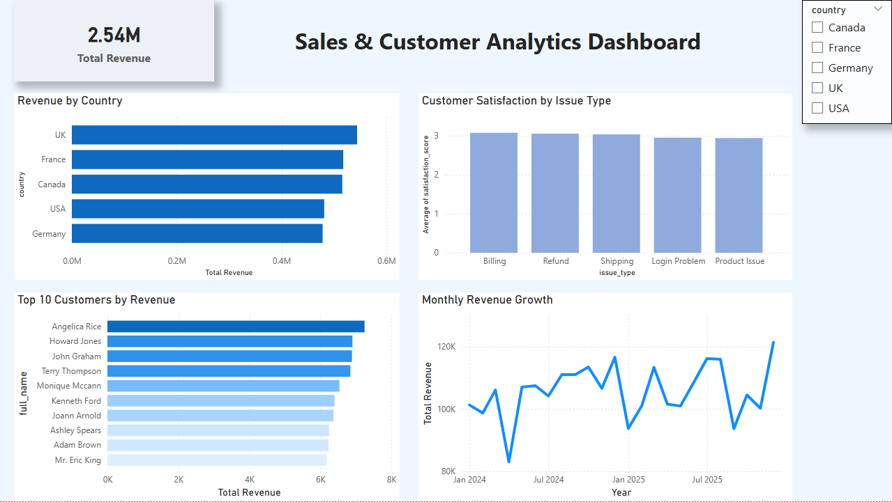
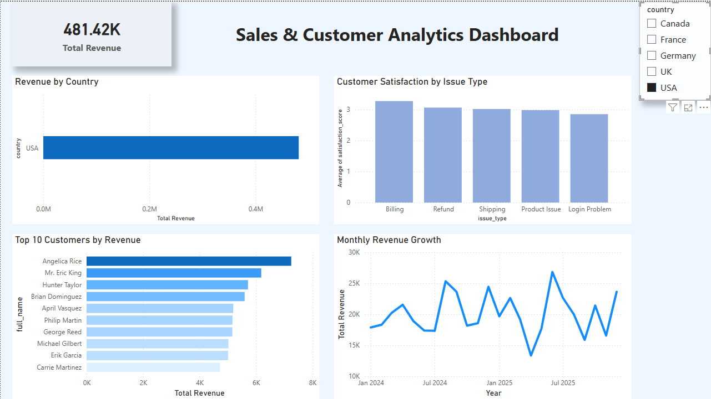

# Customer Sales Analytics Platform

An end-to-end data analytics project that transforms raw business data into actionable insights using ETL pipelines, SQL analytics, and Power BI dashboards.

---

## Project Overview

This project simulates a real-world analytics workflow used by data analysts and data engineers.

It covers the full pipeline:

**Raw Data → ETL (Python) → PostgreSQL → SQL Analysis → Power BI Dashboard**

---

## Architecture

```text
Python (ETL Pipeline)
        ↓
PostgreSQL (Data Warehouse)
        ↓
SQL (Analytics Queries)
        ↓
Power BI (Dashboard Visualization)
```

---

## Features

- Built an ETL pipeline using Python and Pandas to clean and transform raw datasets
- Designed a PostgreSQL data warehouse with a relational schema
- Developed SQL queries to generate key business insights and KPIs
- Created an interactive Power BI dashboard for decision-making
- Analyzed customer behavior, revenue trends, and support performance

---

## Key Insights

- Identified top-performing countries by total revenue
- Tracked monthly revenue trends to detect growth patterns
- Highlighted top customers contributing to revenue
- Analyzed customer satisfaction across different issue types

---

## Tech Stack

- Python
- Pandas
- SQLAlchemy
- PostgreSQL
- SQL
- Power BI
- Git
- GitHub

---

## Project Structure

```text
analytics-platform/
│
├── dashboard/
│   ├── analytics_dashboard.pbix
│   └── screenshots/
│
├── data/
│   ├── raw/
│   └── processed/
│
├── etl/
│   ├── load/
│   ├── transform/
│   └── utils/
│
├── sql/
│   ├── queries/
│   └── schema/
│
├── .gitignore
├── requirements.txt
└── README.md
```

---

## Dashboard Preview

### Main Dashboard View



### Filtered Dashboard View



---

## How to Run

### 1. Clone the repository

```bash
git clone https://github.com/mehmet-akif/customer-sales-analytics-platform.git
cd customer-sales-analytics-platform
```

### 2. Install dependencies

```bash
pip install -r requirements.txt
```

### 3. Configure PostgreSQL connection

Create a `.env` file in the project root and add:

```env
DB_USER=postgres
DB_PASSWORD=your_password
DB_HOST=localhost
DB_PORT=5432
DB_NAME=analytics_platform
```

### 4. Generate raw data

```bash
python etl/utils/generate_data.py
```

### 5. Clean the data

```bash
python etl/transform/clean_data.py
```

### 5. Load data into PostgreSQL

```bash
python -m etl.load.load_to_postgres
```

### 6. Open the Power BI dashboard

Open:

```text
dashboard/analytics_dashboard.pbix
```

---

## Why This Project Matters

This project demonstrates:

- End-to-end data pipeline development
- Strong SQL and relational data modeling skills
- Business-focused analytics and KPI thinking
- Interactive dashboarding and storytelling with data


---

## Author

**Mehmet Akif Sipahi**  
Computer Science Student @ Toronto Metropolitan University
